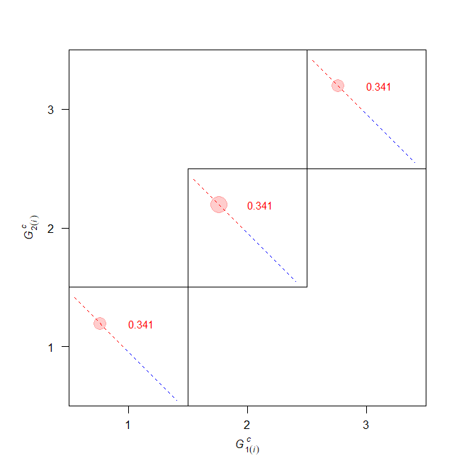
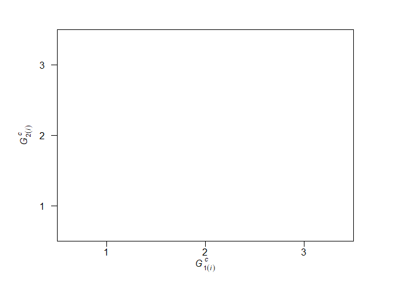
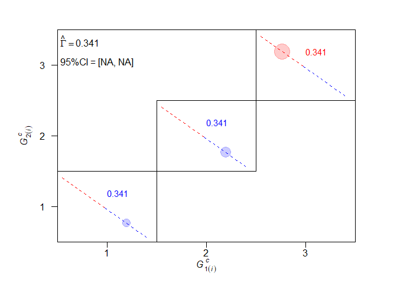

<!-- README.md is generated from README.Rmd. Please edit that file -->

# MHplot

<!-- badges: start -->
<!-- badges: end -->

The goal of MHplot is to visualise the marginal homogeneity of row and
column variables in a square contingency table.

## Installation

You can install the development version of MHplot from
[GitHub](https://github.com/) with:

``` r
# install.packages("devtools")
devtools::install_github("SShinodaPhD/MHplot")
```

## Example

This is a basic example which shows you how to solve a common problem:

``` r
library(MHplot)

mat422 <- matrix(c(
     0, 10, 10, 10,
    30,  0, 10, 10,
    30, 30,  0, 10,
    30, 30, 30,  0
),4,4,byrow=T)
```

If legend is FALSE, the estimate of measure and 95% confidence intervals
are not displayed (default).

``` r
MHplot(mat=mat422, legend = FALSE)
```



``` r
MHplot(mat=mat422)
```



If legend is TRUE, the estimate of measure and 95% confidence intervals
are displayed.

``` r
MHplot(mat=mat422, legend = TRUE)
```


